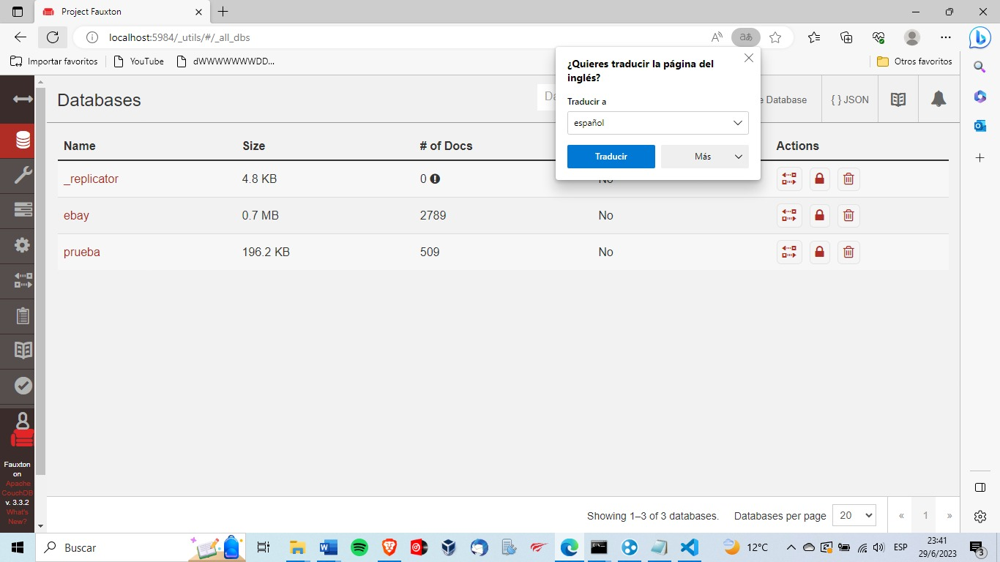

# **Web Scraping y Almacenamiento de Datos en CouchDB**

Breve descripción o resumen del proyecto.

## **Tabla de contenidos**

- __Requisitos previos__
- __Url utilizadas__
- __Explicacion del Código__
- __Réplicas y CouchDB__
- __Contribución__
- __Licencia__

## **Requisitos previos**

Para la realización de este ejercicio a segúrate de tener los siguientes requisitos previos:

- Python 3.x instalado en tu sistema.
- Las bibliotecas **`requests`**, **`beautifulsoup4`** y **`couchdb`** instaladas. Puedes instalarlas ejecutando el siguiente comando:
    
    ```
    pip install requests beautifulsoup4 couchdb
    ```
    
## URLs utilizadas
    ```
    - https://www.amazon.com/s?k=teclado+mecanico&sprefix=teclado%2Caps%2C215&ref=nb_sb_ss_ts-doa-p_1_7',
    - https://www.amazon.com/s?k=amazoncom&adgrpid=78903981782&hvadid=585479891945&hvdev=c&hvlocphy=9069516&hvnetw=g&hvqmt=b&hvrand=2411848897164033687&hvtargid=kwd-11985301&hydadcr=29492_14573937&tag=hydglogoo-20&ref=pd_sl_1omq9vtwvd_b',
    - https://www.amazon.com/-/es/s?k=amazon.com&page=2&adgrpid=78903981782&hvadid=585479891945&hvdev=c&hvlocphy=9069516&hvnetw=g&hvqmt=b&hvrand=2411848897164033687&hvtargid=kwd-11985301&hydadcr=29492_14573937&qid=1688094479&ref=sr_pg_2'
    ```
    
## **Explicacion del codigo**
__Parte 1:__ Importación de bibliotecas y definición de URLs
En esta parte del código, importamos las bibliotecas necesarias para el web scraping, como requests, BeautifulSoup y couchdb. Luego, definimos una lista de URLs en la cual podemos agregar diferentes direcciones de páginas web de Amazon que deseamos raspar.

__Parte 2:__ Conexión a CouchDB
Aquí establecemos una conexión con una base de datos de CouchDB. Utilizamos la función couchdb.Server() para crear una instancia del servidor CouchDB, pasando la URL del servidor y las credenciales de acceso si es necesario. Luego, especificamos el nombre de la base de datos a la que nos conectaremos.

__Parte 3:__ Iteración sobre las URLs y web scraping
En esta sección, recorremos cada URL en la lista urls mediante un bucle for. Para cada URL, realizamos una solicitud HTTP utilizando requests.get() para obtener el contenido de la página. Luego, utilizamos BeautifulSoup para analizar el HTML de la página y poder extraer información de ella.

__Parte 4:__ Definición de etiquetas y extracción de datos
Aquí definimos una lista de etiquetas HTML que queremos extraer de la página. Puedes agregar más etiquetas a esta lista según tus necesidades. Luego, creamos una lista vacía llamada data donde almacenaremos los datos extraídos de las etiquetas.

Utilizamos un bucle for anidado para iterar sobre cada etiqueta en la lista. Dentro de ese bucle, utilizamos soup.find_all() para encontrar todos los elementos que coinciden con la etiqueta actual en el HTML de la página. Luego, recorremos los elementos encontrados y extraemos el contenido de texto de cada uno. Finalmente, agregamos un diccionario con la etiqueta y el contenido extraído a la lista data.

__Parte 5:__ Guardar los datos en CouchDB
En esta sección, iteramos sobre cada elemento en la lista data. Utilizando la conexión a la base de datos de CouchDB establecida anteriormente, utilizamos el método db.save() para guardar cada elemento como un documento en la base de datos.


## **Réplicas y CouchDB**

Se utilizó web scraping para extraer datos de páginas de compras en línea de tecnología. Las etiquetas más comunes en esas páginas fueron seleccionadas para la extracción de datos. Cada integrante del equipo creó una base de datos en CouchDB con el nombre de la tienda de tecnología correspondiente y cargó los documentos obtenidos a través del web scraping en sus respectivas bases de datos.



Posteriormente, se aplicó la técnica de réplicas de bases de datos en CouchDB para consolidar los datos extraídos de las bases de datos individuales de los integrantes en una base de datos principal llamada "PRODUCTOS". Se configuraron las réplicas desde cada base de datos de los integrantes hacia la base de datos principal, de manera que la base de datos "PRODUCTOS" recibió 2.000 documentos de cada integrante, cumpliendo con el requisito de alcanzar un total de 10.000 documentos.

Esto permite tener una base de datos centralizada y actualizada con los datos obtenidos de todas las tiendas de tecnología. Además, se utilizó el programa Hamachi para establecer conexiones remotas entre los integrantes del equipo y facilitar la configuración de las réplicas en CouchDB.
